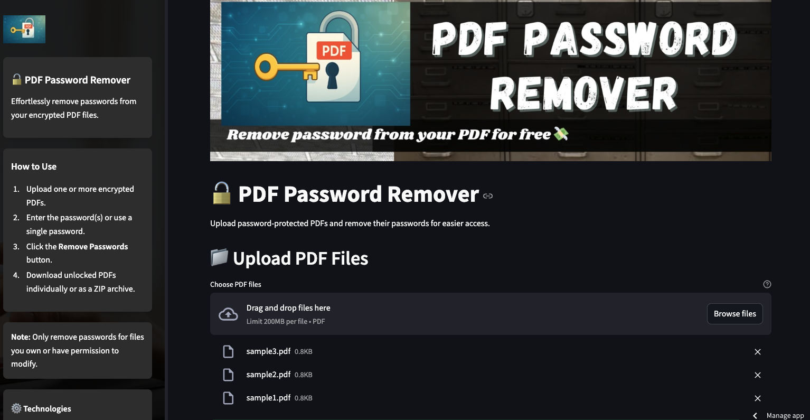
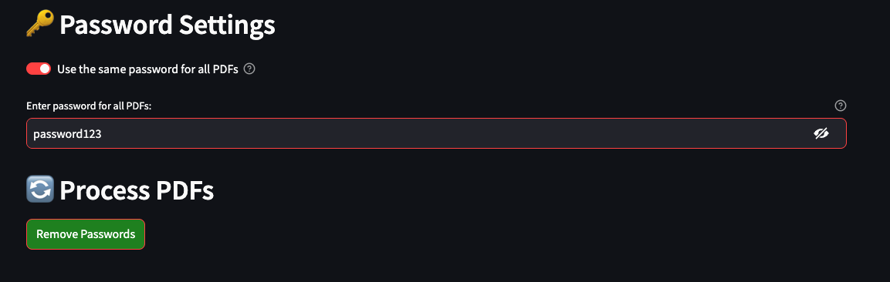
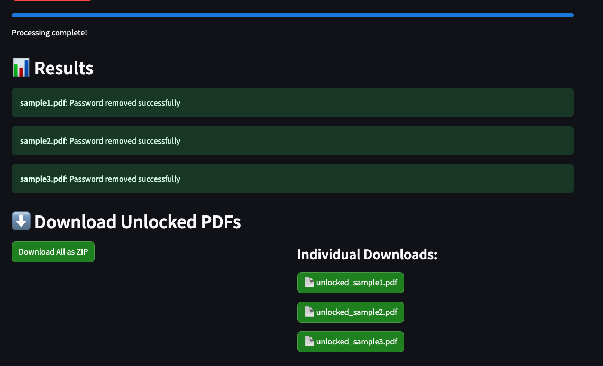

# PDF Password Remover

**Effortlessly Unlock Password-Protected PDFs in Your Browser**

---

<p align="center">
  
  
  
</p>

## Built With

- **Markdown** • **Streamlit** • **Python** • **pypdf**

---

## Overview

This Streamlit app lets you:

1. **Upload** single or multiple password-protected PDF files  
2. **Enter** one common password or individual passwords per file  
3. **Remove** the password barrier with a single click  
4. **Download** unlocked PDFs individually or bundled in a ZIP archive  

All entirely in your browser—no CLI required.

### Demo Example

<p align="center">
  
  <br><em>Main upload screen</em>
</p>

---

## Workflow

```mermaid
flowchart TD
    User -->|Upload PDFs & passwords| StreamlitApp[Streamlit App]
    StreamlitApp -->|unlock_pdf| PdfModule[PdfReader to PdfWriter]
    PdfModule -->|Unlocked bytes| StreamlitApp
    StreamlitApp -->|Download| User
````

---

## Features

* **Bulk Handling** – Upload multiple PDFs at once
* **Flexible Passwords** – Single or per-file password entry
* **Progress Indicators** – Visual progress bar and status messages
* **Session Persistence** – Download links survive page reruns
* **ZIP Export** – Bundle all unlocked files in one archive

---

## Screenshots

<table align="center">
  <tr>
    <td align="center">
      
      <p><em>Enter password & process</em></p>
    </td>
    <td align="center">
      
      <p><em>Results summary & download options</em></p>
    </td>
  </tr>
</table>

---

## Project Structure

```text
pdf-password-remover-app/
├─ assets/
│  ├─ main_app_pic.png
│  ├─ remove_password_pic.png
│  └─ result_pic.png
├─ component.py       # Styling & sidebar UI
├─ main.py            # Streamlit app entrypoint
├─ requirements.txt
└─ README.md
```

---

## Installation

1. **Clone the repo**

   ```bash
   git clone https://github.com/yourusername/pdf-password-remover-app.git
   cd pdf-password-remover-app
   ```
2. **Create & activate a virtual env**

   ```bash
   python3 -m venv .venv
   source .venv/bin/activate   # macOS/Linux
   ```
3. **Install dependencies**

   ```bash
   pip install -r requirements.txt
   ```

---

## Usage

```bash
streamlit run main.py --server.fileWatcherType none
```

1. Open the provided localhost URL in your browser.
2. Upload one or more encrypted PDFs.
3. Enter the password(s).
4. Click **Remove Passwords**.
5. Download unlocked PDFs individually or as a ZIP.

---

## Requirements

```text
streamlit
pypdf
```

---

## License

MIT © 2025 Fahmi Zainal
